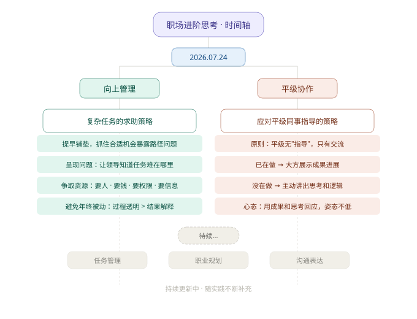

# 职场进阶知识库

> 个人职场成长经验沉淀与积累，按主题分类呈现思考脉络。

---

## 思维导图总览



---

## 主题索引

### 向上管理

| 序号 | 标题 | 一句话总结 |
|------|------|-----------|
| 1 | [复杂任务的求助策略](./向上管理/复杂任务的求助策略.md) | 提早暴露问题、争取资源，避免年终被动——巧妇难为无米之炊 |
| 2 | [绩效考评的汇报策略](./向上管理/绩效考评的汇报策略.md) | 考评前汇报不是述职，是给领导递一个帮你争取绩效的范本 |
| 3 | [应对变化与经营目标的底层逻辑](./向上管理/应对变化与经营目标的底层逻辑.md) | 变化是常态，但万变不离其宗——始终围绕用户数、收入、满意度、战略项目 |
| 4 | [新方案的汇报心法](./向上管理/新方案的汇报心法.md) | 视野要放大、底座要打好、事要自己想着做、多找领导要资源 |
| 5 | [新人如何在领导面前展露](./向上管理/新人如何在领导面前展露.md) | 把自己当产品——先让市场知道，再让客户了解；通过月报双周报持续触达 |
| 6 | [让领导持续看见你的价值](./向上管理/让领导持续看见你的价值.md) | 电梯演讲代替工作总结、主动汇报思维转变、消除领导的不安全感 |
| 7 | [关键人策略：向上两级管理](./向上管理/关键人策略：向上两级管理.md) | 升职加薪关键人可能是+2不是+1；定期建立触点、不让信息链路单一 |
| 8 | [预期管理与努力显性化](./向上管理/向上管理-预期管理与努力显性化.md) | 正面的话选着说、负面的话说正面；不能只呈现结果，要把隐形的努力显性化 |

### 平级协作

| 序号 | 标题 | 一句话总结 |
|------|------|-----------|
| 1 | [应对平级同事指导的策略](./平级协作/应对平级同事指导的策略.md) | 平级无"指导"，只有交流；用成果和思考回应，姿态不低底气才足 |
| 2 | [职场偷师与取长补短](./平级协作/职场偷师与取长补短.md) | 偷师学的不只是知识，更是方法论和思维模式；找准自己的标签，取长补短 |

### 职业规划

| 序号 | 标题 | 一句话总结 |
|------|------|-----------|
| 1 | [提前规划克服学习焦虑](./职业规划/提前规划克服学习焦虑.md) | 学不到东西就会焦虑；优秀的人提前 1-2 年做规划 |
| 2 | [积极争取机会](./职业规划/积极争取机会.md) | 起码要表现得积极，主动争取，不然好事凭什么轮到你 |
| 3 | [普通人的四阶成长逻辑](./职业规划/普通人的四阶成长逻辑.md) | 思维模式 → 系统化管理 → 工程化平台化 → 提炼总结；往优秀环境里钻 |

### 工作方法

| 序号 | 标题 | 一句话总结 |
|------|------|-----------|
| 1 | [高效工作的四个细节](./工作方法/高效工作的四个细节.md) | 表格简洁、看板查询、PPT 极简、夸人社交——四个偷师而来的高效习惯 |
| 2 | [逻辑反应与边界设定](./工作方法/逻辑反应与边界设定.md) | 混乱中理清逻辑说服他人；对犯错保持平常心；直接说出自己的边界 |
| 3 | [跳出执行者陷阱：从埋头苦干到抬头看路](./工作方法/跳出执行者陷阱：从埋头苦干到抬头看路.md) | 别沉溺具体事务；建立底层逻辑思维；用结果说话甩掉学生思维；多干明面上的活 |

### 管理能力

| 序号 | 标题 | 一句话总结 |
|------|------|-----------|
| 1 | [留人与安抚的艺术](./管理能力/留人与安抚的艺术.md) | 留人用真心换真心；安抚下属遵循"事实→道理→共情"三步；定期盘点团队能力增量 |

### 职场生存

| 序号 | 标题 | 一句话总结 |
|------|------|-----------|
| 1 | [职场人情世故与自我保护](./职场生存/职场人情世故与自我保护.md) | 别把导师当朋友、不说家境、保护团队首发权、让人舒服也想帮你 |

---

## 知识库结构

```
职场进阶知识库/
├── README.md
├── 思维导图.svg
├── 向上管理/
│   ├── 复杂任务的求助策略.md
│   ├── 绩效考评的汇报策略.md
│   ├── 应对变化与经营目标的底层逻辑.md
│   ├── 新方案的汇报心法.md
│   ├── 新人如何在领导面前展露.md
│   ├── 让领导持续看见你的价值.md
│   ├── 关键人策略：向上两级管理.md
│   └── 向上管理-预期管理与努力显性化.md
├── 平级协作/
│   ├── 应对平级同事指导的策略.md
│   └── 职场偷师与取长补短.md
├── 职业规划/
│   ├── 提前规划克服学习焦虑.md
│   ├── 积极争取机会.md
│   └── 普通人的四阶成长逻辑.md
├── 工作方法/
│   ├── 高效工作的四个细节.md
│   ├── 逻辑反应与边界设定.md
│   └── 跳出执行者陷阱：从埋头苦干到抬头看路.md
├── 管理能力/
│   └── 留人与安抚的艺术.md
└── 职场生存/
    └── 职场人情世故与自我保护.md
```

---

## 使用说明

- 每条经验独立成文，按主题分类存放
- README 的思维导图按主题呈现，直观展示知识脉络
- 持续更新，随实践不断补充新条目和新维度
